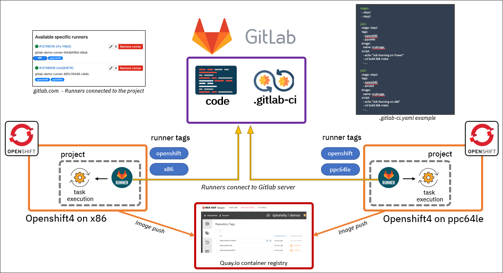

# Introduction to Continuous Integration/Delivery (CI/CD)

# What is CI/CD ?
CI/CD is a way of developing software in which you’re able to release updates at any time in a sustainable way. When changing code is routine, development cycles are more frequent, meaningful and faster.

*Continuous Integration* is the practice of integrating code into a shared repository and building/testing each change automatically, as early as possible - usually several times a day.

*Continuous Delivery* adds that the software can be released to production at any time, often by automatically pushing changes to a staging system.

*Continuous Deployment* goes further and pushes changes to production automatically.


# Why CI/CD ?

## Continuous Integration
- Detects development as quickly as possiblie
    - Fix while fresh in your mind
- Detect security issue earlier
- Reduces integration problems
    - Smaller problems are easier to solved
    - Don’t compound problems
- Allows teams to develop faster, with more confidence


## Continuous Delivery
- Ensures that every change to the system is releasable
- Lowers risk of each release - makes releases “boring”
- Delivers value more frequently
- Get fast feedback on what users care about


# How to use CI/CD ?

- Automate the build
- Make your build self-testing
- Keep the build fast
- Make the process transparent to everyone
- Maintain a single source repository

#### Tool of CI/CD

- Github Action
- Gitlab CI
- Jenkins
- etc

# Gitlab CI

#### Concept
- [Pipelines](https://docs.gitlab.com/ee/ci/pipelines/index.html)

    Pipelines are the top-level component of continuous integration, delivery, and deployment.

- [Artifacts](https://docs.gitlab.com/ee/ci/jobs/job_artifacts.html)

    Jobs can output an archive of files and directories. This output is known as a job artifact.

- [Runner](https://docs.gitlab.com/runner/)

    Runner is an application that works with GitLab CI/CD to run jobs in a pipeline.

- [Variables](https://docs.gitlab.com/ee/ci/variables/index.html)
- [Environments](https://docs.gitlab.com/ee/ci/environments/index.html)
- [Cache](https://docs.gitlab.com/ee/ci/caching/index.html)
- [Pipeline efficiency](https://docs.gitlab.com/ee/ci/pipelines/pipeline_efficiency.html)
- [Test cases](https://docs.gitlab.com/ee/ci/test_cases/index.html)




# Pipeline

#### Stage
Stages, which define when to run the jobs. For example, stages that run tests after stages that compile the code.

#### Job
Jobs, which define what to do. For example, jobs that compile or test code.

#### Pipeline Declare
By default Gitlab CI will read `.gitlab-ci.yml` on your root Project directory.
> Only accept `.yml` extention not `.yaml`

# Variable

#### Variable Type

- Predefined CI/CD Variables [ref](https://docs.gitlab.com/ee/ci/variables/predefined_variables.html)
- Global/Instance Variable
- Group Variable
- Project Variable

# `.gitlab-ci.yml` keyword reference

#### Most Used (by me)
##### Global
- `include`
> Import configuration from other YAML files.

- `stages`
>  The names and order of the pipeline stages.

- `variables`
> Define CI/CD variables for all job in the pipeline.

- `workflow`
> Control what types of pipeline run.

##### Jobs
- `allow_failure`
> Allow job to fail. A failed job does not cause the pipeline to fail.

- `artifacts`
> List of files and directories to attach to a job on success.

- `before_script`
> Override a set of commands that are executed before job.

- `except`
> Control when jobs are not created.

- `extends`
> Configuration entries that this job inherits from.

- `image`
> Use Docker images.

- `needs`
> Execute jobs earlier than the stage ordering.

- `only`
> Control when jobs are created.

- `rules`
> List of conditions to evaluate and determine selected attributes of a job, and whether or not it’s created.

- `script`
> Shell script that is executed by a runner.

- `stage`
> Defines a job stage.

- `tags`
> List of tags that are used to select a runner.

- `variables`
> Define job variables on a job level.

- `when`
> When to run job.

# Conclusion

#### Make First Pipeline
TL;DR:
- Define the stages,
- Define the jobs, and variables,
- Commit the file,
- Push!

# Demo

`.gitlab-ci.yml`
```yaml
variables:
  DEBUG: ""
  NAME: "Demo"

stages:
  - build
  - test
  - deploy

debug:
  stage: .pre
  tags:
    - golang
  rules:
    - if: $DEBUG == "true"
  script:
    - echo "REGISTRY=$REGISTRY"
    - echo "GIT_WORKFLOW=$GIT_WORKFLOW"
    - echo "CI_PIPELINE_SOURCE=$CI_PIPELINE_SOURCE"
    - echo "CI_COMMIT_BRANCH=$CI_COMMIT_BRANCH"
    - echo "CI_OPEN_MERGE_REQUESTS=$CI_OPEN_MERGE_REQUESTS"
    - echo "CI_COMMIT_REF_NAME=$CI_COMMIT_REF_NAME"
    - echo "CI_MERGE_REQUEST_IID=$CI_MERGE_REQUEST_IID"
    - env


build-job:
  stage: build
  tags:
    - golang
  script:
    - echo "Hello, $NAME!"

test-job1:
  stage: test
  script:
    - echo "This job tests something"

test-job2:
  stage: test
  tags:
    - golang
  script:
    - echo "This job tests something, but takes more time than test-job1."
    - echo "After the echo commands complete, it runs the sleep command for 20 seconds"
    - echo "which simulates a test that runs 20 seconds longer than test-job1"
    - sleep 20

deploy-prod:
  stage: deploy
  tags:
    - golang
  script:
    - echo "This job deploys something from the $CI_COMMIT_BRANCH branch."
  environment: production
```


# Reference

1. [CI/CD Pipeline: A Gentle Introduction](https://semaphoreci.com/blog/cicd-pipeline)
2. [Gitlab CI/CD](https://docs.google.com/presentation/d/1OGgk2Tcxbpl7DJaIOzCX4Vqg3dlwfELC3u2jEeCBbDk/htmlpresent)
3. [Gitlab CI](https://docs.gitlab.com/ee/ci/)
4. [CI/CD](https://semaphoreci.com/cicd)
