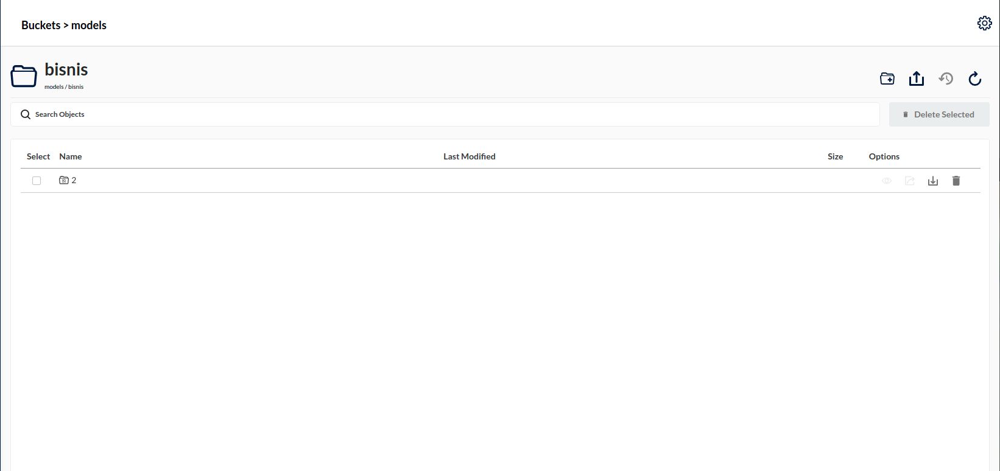

TensorFlow Serving is a flexible, high-performance serving system for machine learning models, designed for production environments. TensorFlow Serving makes it easy to deploy new algorithms and experiments, while keeping the same server architecture and APIs. TensorFlow Serving provides out-of-the-box integration with TensorFlow models, but can be easily extended to serve other types of models and data. (ref: [serving models](https://www.tensorflow.org/tfx/guide/serving#:~:text=TensorFlow%20Serving%20is%20a%20flexible,models%2C%20designed%20for%20production%20environments.&text=TensorFlow%20Serving%20provides%20out%2Dof,types%20of%20models%20and%20data.))

# Introduction

There are a lot way to serve ML models in production. One of most popular is TensorFlow Serving develop by TensorFlow.
This documentation will guide how to serve Tensorflow ML models in production. We will skip how to train and save model to simplify this documentation.
Let say we have business tag prediction for bank transaction with directory like bellow:

```shell
.
└── models
    └── bisnis
        └── 2
            ├── saved_model.pb
            └── variables
                ├── variables.data-00000-of-00001
                └── variables.index
```

This model in base path `$HOME/models/bisnis`.

More information regarding the SavedModel format at TensorFlow SavedModel.

# Environment
- Ubuntu 18.04.5
- Minio RELEASE.2021-09-24T00-24-24Z
- Docker 20.10.12, build e91ed57
- tensorflow/serving:2.5.1

# Deployment

If we already save model using format SavedModel like above, then we just need to serving ML models in TF-Serving.

Pull `tensorflow/serving:2.5.1` images or `tensorflow/serving:2.5.1-gpu` if use GPU
```shell
➜  ~ docker pull tensorflow/serving:2.5.1
latest: Pulling from tensorflow/serving
Digest: sha256:6651f4839e1124dbde75ee531825112af0a6b8ef082c88ab14ca53eb69a2e4bb
Status: Image is up to date for tensorflow/serving:latest
docker.io/tensorflow/serving:latest
```


To serve with Docker, you'll need:
- An open port on your host to serve on. 
- A SavedModel to serve
- A name for your model that your client will refer to

## Model in local directory

In order to reproduce the TF-Serving deployment, you can use the following set of commands:
```shell
➜  ~ docker run -p 8501:8501 \
    -p 8500:8500 \
    --name bisnis \
    --mount type=bind,source=$HOME/models/bisnis,target=/models/bisnis \
    -e MODEL_NAME=bisnis \
    -d tensorflow/serving:2.5.1

5bf2114ad46c5892ff52840fff6f6ecf991e9af99bbc246bc87ff5da25e040a8
```

**Note**: make sure that you use the -d flag in docker run so that the container runs in the background and does not block your terminal. More detailed explanation on the flags used is presented:

- `-p`: this is the port to listen on for the gRPC/REST API, the default value for  gRPC is 8500 and for REST is 8501; but it's a common practice to still define this flag's value so as to always know the configuration of the deployed TF-Serving Server.
- `--name`: this is the name of the image docker.
- `-e MODEL_NAME`: this is the name of the ML model to serve, which is the one that will be exposed in the endpoint.
- `--mount (source)`: this is the base path where the ML model that is going to be served is placed in. Note that his is the absolute path, do not use relative paths.
- `--mount (target)`: this is the base path where the ML model will be store in docker. It’s common to store model in models/<model_name>

Once TF-Serving has been successfully deployed, you can send a sample HTTP GET request to the Model Status REST API available at `http://localhost:8501/v1/models/bisnis`; that returns the basic information of the served ML model.

```
curl http://localhost:8501/v1/models/bisnis
```

That should output something similar to the following JSON response if everything succeeded:
```
{
 "model_version_status": [
  {
   "version": "2",
   "state": "AVAILABLE",
   "status": {
    "error_code": "OK",
    "error_message": ""
   }
  }
 ]
}
```

## Model In Cloud Storage

For mimicking AWS Cloud Storage lets use minio in our local development machine. If you didn’t have. install minio first see: MinIO Quickstart Guide.

Run minio:
```shell
➜  ~ minio server minio-data

┏━━━━━━━━━━━━━━━━━━━━━━━━━━━━━━━━━━━━━━━━━━━━━━━━━━━━━━━━━━━━━━━━━┓
┃ You are running an older version of MinIO released 4 months ago ┃
┃ Update: Run `mc admin update`                                   ┃
┗━━━━━━━━━━━━━━━━━━━━━━━━━━━━━━━━━━━━━━━━━━━━━━━━━━━━━━━━━━━━━━━━━┛

API: http://192.168.1.2:9000  http://192.168.32.1:9000  http://172.18.0.1:9000  http://172.19.0.1:9000  http://172.20.100.1:9000  http://172.21.0.1:9000  http://172.22.0.1:9000  http://172.23.0.1:9000  http://172.24.0.1:9000  http://172.25.0.1:9000  http://172.26.0.1:9000  http://172.27.0.1:9000  http://172.17.0.1:9000  http://127.0.0.1:9000         
RootUser: minio 
RootPass: minioadmin13 

Console: http://192.168.1.2:40073 http://192.168.32.1:40073 http://172.18.0.1:40073 http://172.19.0.1:40073 http://172.20.100.1:40073 http://172.21.0.1:40073 http://172.22.0.1:40073 http://172.23.0.1:40073 http://172.24.0.1:40073 http://172.25.0.1:40073 http://172.26.0.1:40073 http://172.27.0.1:40073 http://172.17.0.1:40073 http://127.0.0.1:40073     
RootUser: minio
RootPass: minioadmin13 

Command-line: https://docs.min.io/docs/minio-client-quickstart-guide
   $ mc alias set myminio http://192.168.1.2:9000 minio minioadmin13

Documentation: https://docs.min.io

WARNING: Console endpoint is listening on a dynamic port (40073), please use --console-address ":PORT" to choose a static port.
```

Put our model in bucket



Check bucket with [aws-cli](https://docs.aws.amazon.com/cli/latest/userguide/getting-started-install.html).

**Note**: use your real IP (see your real IP after run minio) instead use 127.0.0.1

```shell
➜  ~ aws --endpoint-url http://192.168.1.2:9000 s3 ls
2021-09-28 14:57:46 models
```

In order to reproduce the TF-Serving deployment, you can use the following set of commands:
```shell
➜  ~ docker run -p 8501:8501 \
        -p 8500:8500 \
        -e AWS_ACCESS_KEY_ID=accesskey13 \
        -e AWS_SECRET_ACCESS_KEY=secretkey13 \
        -e MODEL_BASE_PATH=s3://models \
        -e MODEL_NAME=bisnis \
        -e S3_ENDPOINT=http://192.168.1.2:9000 \
        -e S3_USE_HTTPS=0 \
        -e S3_VERIFY_SSL=0 \
        -e TF_CPP_MIN_LOG_LEVEL=0 \
        -d tensorflow/serving:2.5.1
```

When your models in Google Cloud Storage, you need more complex credential. Better we make Dockerfile than use direct command.
First, you need generate Google Cloud Storage Credential with format:

`gs.json`
```json
{
  "type": "service_account",
  "project_id": "your_project_name",
  "private_key_id": "1924888c2668a782722816de8231b228cba883e9",
  "private_key": "your_private_key",
  "client_email": "your_client_email",
  "client_id": "your_client_id",
  "auth_uri": "this_is_auth_url",
  "token_uri": "this_is_token_uri",
  "auth_provider_x509_cert_url": "your_auth_provider",
  "client_x509_cert_url": "your_client_x509_cert_url"
}
```


`Dockerfile`
```docker
FROM tensorflow/serving:2.5.1

# Copy google storage credential
COPY ./gs.json /etc/gs/gs.json

# Only root can access the google-cloud-storage-private-key access.
RUN chown root:root /etc/gs && \
    chmod 640 /etc/gs

ENV TF_CPP_VMODULE=http_server=1 \
    TF_CPP_MIN_LOG_LEVEL=0 \
    TF_CPP_MIN_VLOG_LEVEL=0

# Set base path where your models stored in bucket
# Set your model name
# Set google storage credential for accessing models
ENV MODEL_BASE_PATH=gs://your_bucket_url/models \
    MODEL_NAME=bisnis \
    GOOGLE_APPLICATION_CREDENTIALS=/etc/gs/gs.json

# Expose ports gRPC
EXPOSE 8500
# Expose ports REST
EXPOSE 8501

# Create a script that runs the model server so we can use environment variables
# while also passing in arguments from the docker command line
RUN echo '#!/bin/bash \n\n\
tensorflow_model_server --port=8500 --rest_api_port=8501 \
--tensorflow_intra_op_parallelism=5 \
--tensorflow_inter_op_parallelism=5 \
--model_name=${MODEL_NAME} --model_base_path=${MODEL_BASE_PATH}/${MODEL_NAME} \
--enable_batching=true \
--batching_parameters_file=${BATCHING_PARAMETERS_FILE} "$@" \
--model_config_file=${MODEL_CONFIG_FILE} "$@"' > /usr/bin/tf_serving_entrypoint.sh

ENTRYPOINT ["/usr/bin/tf_serving_entrypoint.sh"]
```

Build and run the image:
```shell
➜  ml-gateway docker build --compress --rm --no-cache -t bisnis -f Dockerfile .     
Sending build context to Docker daemon  777.7MB
Step 1/9 : FROM tensorflow/serving:latest
 ---> e874bf5e4700
Step 2/9 : COPY ./gs.json /etc/gs/gs.json
 ---> 7c06f39f66af
Step 3/9 : RUN chown root:root /etc/gs &&     chmod 640 /etc/gs
 ---> Running in 727f5db730c0
Removing intermediate container 727f5db730c0
 ---> e4fbc7cb5042
Step 4/9 : ENV TF_CPP_VMODULE=http_server=1     TF_CPP_MIN_LOG_LEVEL=0     TF_CPP_MIN_VLOG_LEVEL=0
 ---> Running in 80e16a72f4a6
Removing intermediate container 80e16a72f4a6
 ---> 12d408e9392c
Step 5/9 : ENV MODEL_BASE_PATH=gs://your_bucket_url/models     MODEL_NAME=bisnis     GOOGLE_APPLICATION_CREDENTIALS=/etc/gs/gs.json
 ---> Running in 5ce3e1c86861
Removing intermediate container 5ce3e1c86861
 ---> ff49766f0ff9
Step 6/9 : EXPOSE 8500
 ---> Running in 60a8b1de8cbb
Removing intermediate container 60a8b1de8cbb
 ---> b7bfcaa290f2
Step 7/9 : EXPOSE 8501
 ---> Running in 2156edbd4bca
Removing intermediate container 2156edbd4bca
 ---> 4f00f9d56563
Step 8/9 : RUN echo '#!/bin/bash \n\ntensorflow_model_server --port=8500 --rest_api_port=8501 --tensorflow_intra_op_parallelism=5 --tensorflow_inter_op_parallelism=5 --model_name=${MODEL_NAME} --model_base_path=${MODEL_BASE_PATH}/${MODEL_NAME} --enable_batching=true --batching_parameters_file=${BATCHING_PARAMETERS_FILE} "$@" --model_config_file=${MODEL_CONFIG_FILE} "$@"' > /usr/bin/tf_serving_entrypoint.sh
 ---> Running in f8f156423fe9
Removing intermediate container f8f156423fe9
 ---> 448f25a172b1
Step 9/9 : ENTRYPOINT ["/usr/bin/tf_serving_entrypoint.sh"]
 ---> Running in cf39058985c0
Removing intermediate container cf39058985c0
 ---> 8a45204191a7
Successfully built 8a45204191a7
Successfully tagged bisnis:latest

➜  ml-gateway docker run -p 8501:8501 -p 8500:8500 8a45204191a7
2022-02-01 15:50:37.452277: I tensorflow_serving/model_servers/server.cc:89] Building single TensorFlow model file config:  model_name: bisnis model_base_path: gs://your_bucket_url/models/bisnis
2022-02-01 15:50:37.452551: I tensorflow_serving/model_servers/server_core.cc:465] Adding/updating models.
2022-02-01 15:50:37.452566: I tensorflow_serving/model_servers/server_core.cc:591]  (Re-)adding model: bisnis
2022-02-01 15:50:44.772607: I tensorflow_serving/core/basic_manager.cc:740] Successfully reserved resources to load servable {name: bisnis version: 2}
2022-02-01 15:50:44.772657: I tensorflow_serving/core/loader_harness.cc:66] Approving load for servable version {name: bisnis version: 2}
2022-02-01 15:50:44.772683: I tensorflow_serving/core/loader_harness.cc:74] Loading servable version {name: bisnis version: 2}
2022-02-01 15:50:45.225926: I external/org_tensorflow/tensorflow/cc/saved_model/reader.cc:38] Reading SavedModel from: gs://your_bucket_url/models/bisnis/2
2022-02-01 15:50:50.276786: I external/org_tensorflow/tensorflow/cc/saved_model/reader.cc:90] Reading meta graph with tags { serve }
2022-02-01 15:50:50.276905: I external/org_tensorflow/tensorflow/cc/saved_model/reader.cc:132] Reading SavedModel debug info (if present) from: gs://your_bucket_url/models/bisnis/2
2022-02-01 15:50:50.622864: I external/org_tensorflow/tensorflow/core/platform/cpu_feature_guard.cc:142] This TensorFlow binary is optimized with oneAPI Deep Neural Network Library (oneDNN) to use the following CPU instructions in performance-critical operations:  AVX2 FMA
To enable them in other operations, rebuild TensorFlow with the appropriate compiler flags.
2022-02-01 15:50:51.171422: I external/org_tensorflow/tensorflow/cc/saved_model/loader.cc:206] Restoring SavedModel bundle.
2022-02-01 15:50:52.420712: I external/org_tensorflow/tensorflow/core/platform/profile_utils/cpu_utils.cc:114] CPU Frequency: 1999965000 Hz
```

**Note**: 
There is not a way to gracefully shutdown server in TF-Serving.
What you can do is add tini to your Docker image. Tini then makes sure that it correctly handles the default signal handlers, such as SIGTERM, so you don’t have to wait ten seconds.

#Troubleshooting
When use minio in your local machine and ufw was enable then you will got that connection from inside docker can not access your minio in outside docker.
This message will show when you run 
```shell
➜  sudo journalctl -f

Jan 21 22:28:23 kw kernel: [UFW BLOCK] IN=docker0 OUT= PHYSIN=veth9d6736b MAC=02:42:03:31:03:bd:02:42:ac:11:00:02:08:00 SRC=172.17.0.2 DST=192.168.1.5 LEN=60 TOS=0x00 PREC=0x00 TTL=64 ID=46883 DF PROTO=TCP SPT=36484 DPT=9000 WINDOW=64240 RES=0x00 SYN URGP=0
```
For the lazy ones solution:
```sheell
sudo ufw disable 
```

# Reference
- [Add SIGTERM handler to TensorFlow Serving container](https://github.com/mylesagray/anpr-knative/issues/11)
- [Tensorflow with gcs issue](https://github.com/tensorflow/serving/issues/1700)
- [Tensorflow serving s3 and ocker](https://stackoverflow.com/questions/54328502/tensorflow-serving-s3-and-docker)
- [Tensorflow docker with s3](https://github.com/tensorflow/serving/issues/1684)
- [Docker localhost connection blocked by UFW](https://stackoverflow.com/questions/54059174/docker-localhost-connection-blocked-by-ufw)
- [Serving TensorFlow models with TensorFlow Serving](https://towardsdatascience.com/serving-tensorflow-models-with-tensorflow-serving-9f1058ac7140)

